# Chapter 03: Installing your Hyperledger Composer Development Environment

[Return to Table of Contents](../README.pdf)

The HyperLedger Fabric development environment, which is used as the foundation for HyperLedger Composer development, is only available for direct installation on OSX and on on Ubuntu V14 LTS and V16 LTS. Knowing that there are many Windows based developers, this chapter includes installation instructions for Windows as well as OSX and Ubuntu. We will use the free VirtualBox tool to install Ubuntu and then do our development there. 

The installation instructions have been tested in the following configurations:

 - OSX Sierra, High Sierra
 - Ubuntu 64bit (V16 LTS) Guest on OSX Sierra
 - Ubuntu 64bit (V16 LTS) Native
 - Ubuntu 64bit (V16 LTS) Guest on Windows 7

 The first section tells you how to install on OSX, Ubuntu or Windows. 

 The end of this section covers getting your own personal copy of the full tutorial. 

## Install on OSX
The installation process for OSX has been automated and is designed to be invoked via a single command. You will need to be network connected for the duration of the installation process, which will take 15 minutes to a couple of hours, depending on your available network speed and capacity. 
- Open a terminal window and navigate to your github folder. 
 - Execute the following command on a single line: 
```curl -H 'Accept: application/vnd.github.v3.raw' https://raw.githubusercontent.com/rddill-IBM/ZeroToBlockchain/master/setup_OSX.sh | bash```
 - This will download an installation exec from the ZeroToBlockchain repository and execute it on your system. This command will go through the following steps, informing you of each step in the process
   - Check for the presence of the Brew package manager and install it if it’s missing. If it’s present, execute the brew update and brew upgrade commands, install the dos2unix tool
   - Check for the presence of git and install it if it’s missing
   - Install GitHub Desktop V 2.33
   - Check for the presence of nodeJS version 6 (Required for hyper ledger) and install it if it’s missing
   - Install the nodejs SDK for hyper ledger composer
   - Install the hyper ledger fabric docker images
   - Install the fabric tools and update your .bash_profile
   - Install hyper ledger  composer platform-specific binaries

If you do not want to automatically take all of these actions, then execute the following command, instead, to just download the file to your system:
   - ```curl -H 'Accept: application/vnd.github.v3.raw' https://raw.githubusercontent.com/rddill-IBM/ZeroToBlockchain/master/setup_OSX.sh```
   - then type in: ```dos2unix setup_OSX.sh```, which will ensure that this will now run correctly as a script file on your OSX operating system. 

You have the ability to turn off any of the installation services. This is dependent on using the Brew package manager to handle various installation requirements, so if you don't want to use Brew, you'll need to install each service manually. 

 - To get help for the script, just type in ```./setup_OSX.sh -h```, which will cause the following information to print out: 
 ```
       installation script for the Zero To Blockchain Series
       This is for Mac OSX ONLY
       This script will check to see if HomeBrew is installed
          and install it if it's not already present. 
       It will then execute a brew update and brew upgrade to ensure
          that you are at the latest release of your brew installed packages
       dos2unix is installed by brew to correct scripts from hyperledger and composer
       The exec will proceed with checking to ensure you are at Node V6
          which is required for working with HyperLedger Composer
       The script will then install the nodejs SDK for hyperledger and composer
       The script will finish by downloading the docker images for hyperledger

 options for this exec are: 
       -h Print this help information
       -g defaults to true. use -g false if you do not want to have git installation checked
       -b defaults to true. use -b false if you do not want to have brew installation checked
       -n defaults to true. use -n false if you do not want to have node installation checked
       -s defaults to true. use -s false if you do not want to have node SDK installation checked
       -d defaults to true. use -d false if you do not want to have hyperledger node images verified
       -p defaults to /Users/robertdill/fabric-tools. use -p /Users/robertdill/your/preferred/path/fabric-tools/your/path/here if you want to install hyperledger fabric tools elsewhere.
       		only valid with -d true, ignored otherwise
 ```
 - So if you want to install only the node services (that is, don't install git or brew), then you would type in the following: ```./setup_OSX.sh -g false -b false```, which turns off the installation options for git and brew. 

 Once you have run this exec, your development environment will be installed. Before you can run it, you'll have to start Docker. Press CMD+spacebar and type in docker. Highlight Docker.app and press enter. On most OSX systems, Docker.app will automatically restart each time you start up, or restart OSX. 

## Install on Ubuntu

The installation process for Ubuntu has been automated and is designed to be invoked via a single command. You will need to be network connected for the duration of the installation process, which will take 15 minutes to a couple of hours, depending on your available network speed and capacity. 
- Open a terminal window and navigate to your github folder. 
 - ```sudo apt-get update```
 - ```sudo apt-get install -y curl```
 - After curl has been installed, copy the following as a single line into a terminal window and press enter
 - ```curl -H 'Accept: application/vnd.github.v3.raw' https://raw.githubusercontent.com/rddill-IBM/ZeroToBlockchain/master/setup_Ubuntu_Part_1.sh | bash```
 - This will install all required software up through docker. If you do not want to automatically install this software, then first download the the script and then use the available options to limit what it does. 
 - To download the script, execute the following command: ``````
 - The type in ```dos2unix setup_Ubuntu_Part_1.sh```
 - Then type in ```./setup_Ubuntu_Part_1.sh```
 - Then type in ```./setup_Ubuntu_Part_1.sh -h```, which will print out the following information: 
 ```
        installation script for the Zero To Blockchain Series
       This is for Linux ONLY. It has been tested on Ubuntu 16.04 LTS
       Other versions of Linux are not supported via this script. 
       The following will be downloaded by this script
       dos2unix, to correct scripts from hyperledger and composer
       docker for Ubuntu
       The exec will proceed with checking to ensure you are at Node V6
       which is required for working with HyperLedger Composer
       The script will then install the nodejs SDK for hyperledger and composer
       The script will finish by requesting that you reboot your system


 options for this exec are: 
       -h Print this help information
       -g defaults to true. use -g false if you do not want to have git installation checked
       -n defaults to true. use -n false if you do not want to have node installation checked
       -v defaults to true. use -v false if you do not want to have vscode installed
       -s defaults to true. use -s false if you do not want to have node SDK installation checked
       -d defaults to true. use -d false if you do not want to have docker installed
```
 - type in ./setup_Ubuntu_Part_1.sh followed by any flag (e.g. -g) followed by the word false to disable the installation of that service.
 - ***You will then need to reboot your system prior to executing the following command:***
 - ```curl -H 'Accept: application/vnd.github.v3.raw' https://raw.githubusercontent.com/rddill-IBM/ZeroToBlockchain/master/setup_Ubuntu_Part_2.sh | bash```
 - This will complete the installation of the hyper ledger images and the supporting tools. 
 - This command will go through the following steps, informing you of each step in the process
   - Update the apt-get repositories and upgrade current software
   - Ensure that the base development environment is installed
   - Check for the presence of git and install it if it’s missing
   - Check for the presence of nodeJS version 6 (Required for hyper ledger) and install it if it’s missing
   - Install the nodejs SDK for hyper ledger composer
   - Install the VSCode editor
   - Install the hyper ledger fabric docker images
   - Install the fabric tools and update your .bash_profile
   - Install hyper ledger  composer platform-specific binaries

If you do not want to automatically take all of these actions, then execute the following command, instead, to just download the file to your system:
   - ```curl -H 'Accept: application/vnd.github.v3.raw' https://raw.githubusercontent.com/rddill-IBM/ZeroToBlockchain/master/setup_Ubuntu_Part_2.sh```
   - then type in: ```dos2unix setup_Ubuntu_Part_2.sh```, which will ensure that this will now run correctly as a script file on your √ operating system. 

You have the ability to turn off any of the installation services. This is dependent on using the Brew package manager to handle various installation requirements, so if you don't want to use Brew, you'll need to install each service manually. 

 - To get help for the script, just type in ```./setup_Ubuntu_Part_2.sh -h```, which will cause the following information to print out: 
 ```
       installation script for the Zero To Blockchain Series
       This is for Linux ONLY. It has been tested on Ubuntu 16.04 LTS
       Other versions of Linux are not supported via this script. 
       The following will be downloaded by this script
       The script will finish by downloading the docker images for hyperledger


 options for this exec are: 
       -h Print this help information
       -f defaults to true. use -d false if you do not want to have hypleledger fabric images verified
       -p defaults to /home/robertdill/fabric-tools. use -p /home/robertdill/your/preferred/path/fabric-tools/your/path/here if you want to install hyperledger fabric tools elsewhere.
       		only valid with -f true, ignored otherwise

 ```
 - So if you want to install only the node services (that is, don't install git or brew), then you would type in the following: ```./setup_OSX.sh -g false -b false```, which turns off the installation options for git and brew. 

 Once you have run this exec, your development environment will be installed. Before you can run it, you'll have to start Docker. Press CMD+spacebar and type in docker. Highlight Docker.app and press enter. On most OSX systems, Docker.app will automatically restart each time you start up, or restart OSX. 
 
## Install on Windows V7 or V10

Because HyperLedger Fabric does not yet support Windows Native installation, we will install an Ubuntu guest operating system on your Windows computer. The following installation instructions use VirtualBox to create an environment for Ubuntu. You can also use VMWare or any technology of your choice which will allow you to install the 64bit version of Ubuntu V16 LTS (Long Term Service). 

The installation process for Windows is: 
Step 1: download a 64-bit Ubuntu 16.04 image. The installation will fail if you install a 32-bit image
  - Go here: https://www.ubuntu.com/download 
  - click on the Ubuntu Desktop option - this is a large download and will take 30+ minutes
Step 2: download and install VirtualBox
  - Go here: https://www.virtualbox.org/wiki/Downloads 
  - And click on Windows Hosts. This will start the download of the VirtualBox installer
Step 3: Go to your downloads folder and run the VirtualBox …. .exe installer.
  - Take the defaults
Step 4: Start Virtual Box
  - Click on the “new” icon
  - Take all the defaults EXCEPT memory. 
  - Give your virtual machine at least 2Gb rather than the 1Gb default. If you have sufficient memory, I recommend 4-8Gb.
Step 5: Follow the steps for an Ubuntu installation on the following pages. 

### Step 1: download a 64-bit Ubuntu 16.04 image.

 - Go here: https://www.ubuntu.com/download 
 - 
 - and download V16 of the Ubuntu Desktop, which provides a graphical UI similar to OSX and Windows. 
 - You may find that you have to choose between an Intel or I386 version and an AMD version. Regardless of what technology is on your computer, pick the AMD version. These are poorly named. AMD represents the 64bit version, which runs on Intel and AMD processors and the Intel or I386 version is the 32 bit version, which you do NOT want. 


### Step 2: download and install VirtualBox

 - Go here: https://www.virtualbox.org/wiki/Downloads 
 - And click on Windows Hosts. This will start the download of the VirtualBox installer
 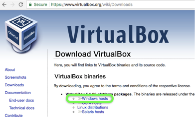
  - After the download completes, run the virtualbox exe which was placed in your download folder

### Step 3: Go to your downloads folder and run the VirtualBox …. .exe installer

 - Now that Virtual Box has been installed, start it and select the 'New' option:
 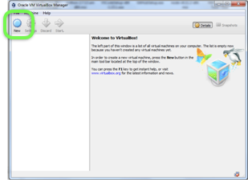
  - Select Linux and Ubuntu 64 bit
  
  - give yourself at least 2Gb of ram, more if you can afford it.
  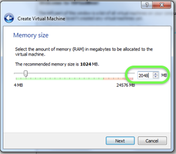
  - Create a virtual drive
  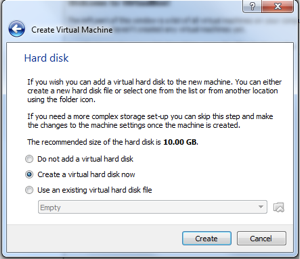
  - and take the default VDI option
  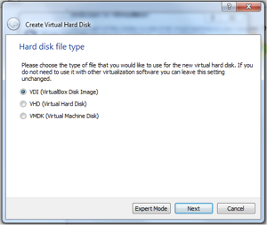
  - Allocate storage dynamically
  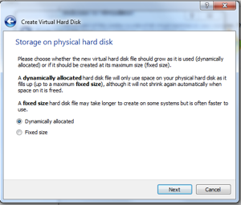
  - **Give yourself at least 20Gb.** This is the minimum for developing these applications
  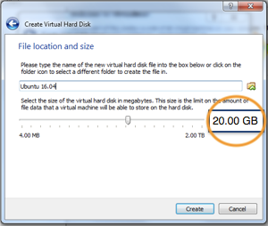
  - Select Next
  

### Step 4: Start Virtual Box

  - Select the image you downloaded 
  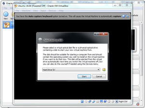
  - After the machine starts, select the “Install Ubuntu Desktop” option
 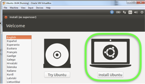
 - Select options to update the installation and to install 3rd party code
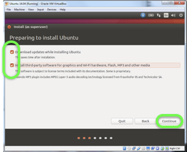
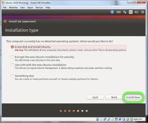

### Step 5: Follow the steps for an Ubuntu installation

# Get the Tutorial

Now that you have the development environment installed, let's get the tutorial onto your computer. If you're already familiar with github, the process I'll recommend to you is fork and clone, so that you have your own personal copy which you can preserve in your github space. 

If github is new to you, please use the following process: 

 - Log into [github](https://github.com) and, if needed, create a new user id and password. 
 - Go the Zero To Blockchain github repository [here](https://github.com/rddill-IBM/ZerotoBlockchain)
 - Select the 'Fork' option to create your own copy of this repository
 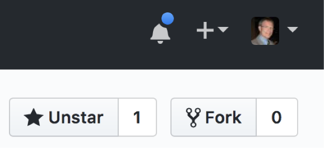
 - Go to your (new) personal copy of the ZeroToBlockchain tutorial (this should happen automatically)
 - Click on the Clone button
 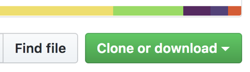
 - and then click on the copy button
 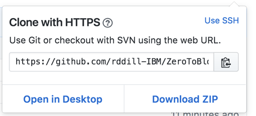
 - open a terminal window in your Ubuntu or OSX operating system and move to your github folder. 
    - if you don't yet have a folder into which you store your github cloned repositories, I recommend that you create one. 
    - For example change to your Documents folder ```cd Documents``` and create a github folder: ```mkdir github```
    - then move into that folder: ```cd github```
    - type ```git clone ``` and then paste in what you copied from your browser window. The command should look something like the following: ```git clone https://github.com/<your user name>/ZeroToBlockchain.git```
    - press the enter key.

This will make a local copy of the tutorial on your computer and, because you cloned from your personal copy of the tutorial, will allow you to save your work up to github.com and, if you choose, share your work with others. 
# Check out the network

 - Open a Terminal Window and change to Chapter03
 - OSX: Issue the command ```buildAndDeploy``` and press enter, which will create a file called zerotoblockchain-network.bna in the Chapter03/network/dist folder. 
 - Ubuntu: Issue the command ```./buildAndDeploy``` and press enter, which will create a file called zerotoblockchain-network.bna in the Chapter03/network/dist folder. 
 - Open HyperLedger Composer [Playground](https://composer-playground.mybluemix.net) and then click on the web page to select the option to use your own business network 
    - You may get the following message. If so, congrats! You've used playground before. Click on ```Clear local Storage```
    
    - You may see this message. If so, click on ```Let's Blockchain!```
    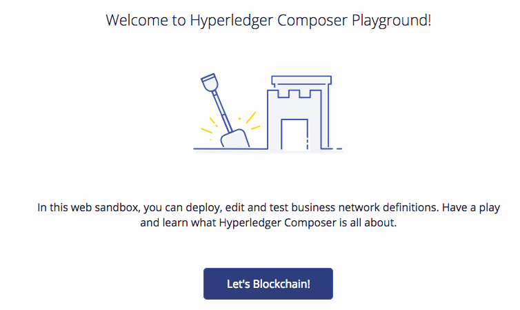
    - You should then see this page. Click on the right hand icon - deploy a new business network
    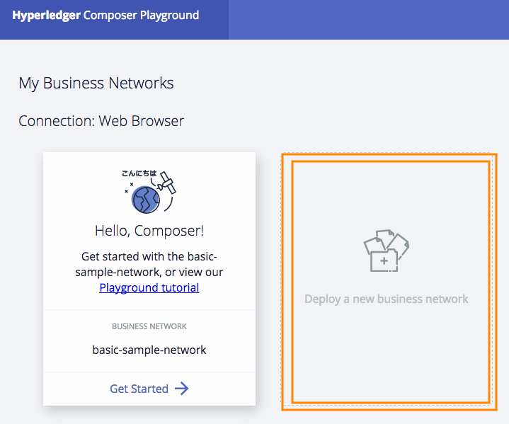
    - which takes you to this page: 
    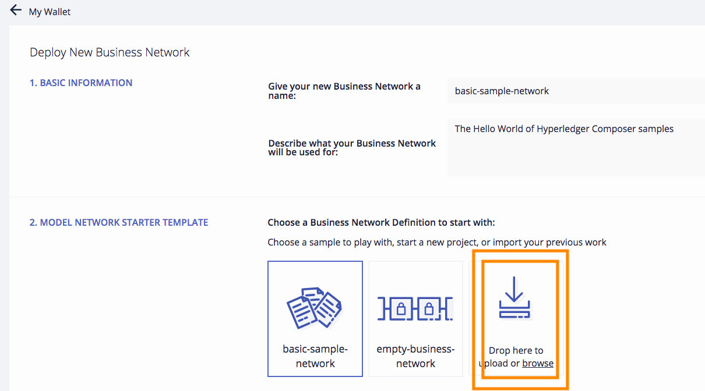
    - navigate in Finder (OSX) or the Ubuntu File Explorer to Chapter03/network/dist
    - and then drag the ```zerotoblockchain-network.bna``` file to the highlighted icon in the playground
    - The right hand side of the screen will now activate. Press the ```Deploy```  button
    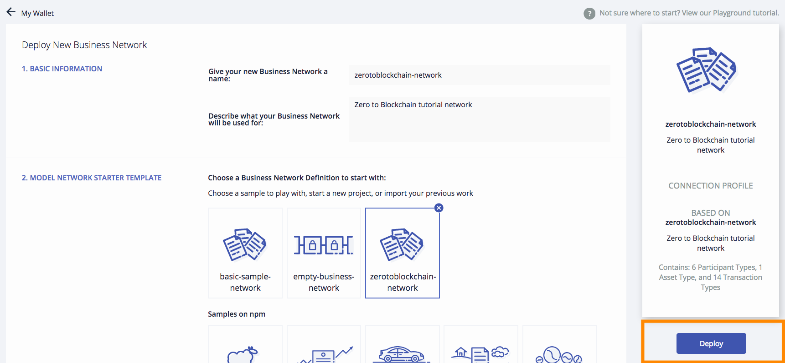